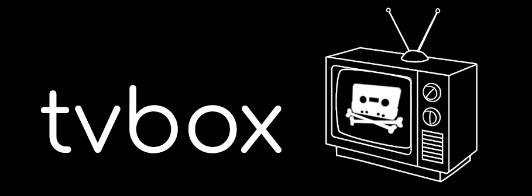

**by Peak 15 Labs**

Creates a classic TV-like experience from a collection of your own media.  
Originally designed to run on a Raspberry Pi stuffed inside an actual retro cable TV box, but should run on any linux machine.

## Dependencies:

- python-vlc
- X11 (doesn't work well on wayland)
- ffprobe
- lxterminal
- feh
- wmctrl
- libnotify-bin (and a notification daemon)
- bash
- lirc (optional)
- gpiozero (optional)

## Instructions:

- (optional) Get [LIRC](https://www.lirc.org/) working. Some potentially useful files are in `external_config_files/lirc`.


- Install dependencies.


- Put the tvbox directory wherever you like, such as `~/tvbox`.


- Copy `tvboxrc.example` to `$XDG_CONFIG_HOME/tvboxrc` or `~/.config/tvboxrc` and customise.


- Create a directory for your channel files, such as `~/tvbox_media/channels`. Channel files can also be stored throughout your media collection, they do not need to be stored all in the same directory. tvbox will walk the entire directory tree specified by `$TVBOX_CHANNELS_DIR`.


- Generate your channel files using `makechannel`. Run `makechannel` with no arguments to see usage instructions. `makechannel` will output to stdout, pipe its output to a channel file, like:
```
# Running this command from inside ~/tvbox_media/channels/ to create relative paths.
~/tvbox/makechannel ../example_video_dir > example.channel
```


- Run `tvbox`. You can also run `irtvboxlaunch` instead, which first kills all tvbox related processes before running `tvbox`.


- To change to the next channel: Connect `GPIO017` to ground, press LIRC key `KEY_CHANNELUP`, or send `SIGUSR1`.  
To change to the previous channel: Connect `GPIO027` to ground, press LIRC key `KEY_CHANNELDOWN`, or send `SIGUSR2`.


- To exit, send `SIGTERM`. This can be done through LIRC with `irexec`.


- (optional) Put `external_config_files/tvbox.desktop` in `$XDG_CONFIG_HOME/autostart/` or `~/.config/autostart` to autostart tvbox.
