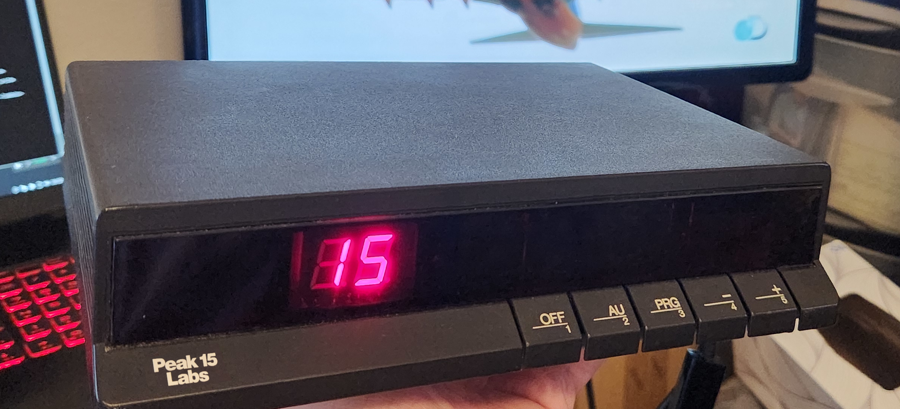
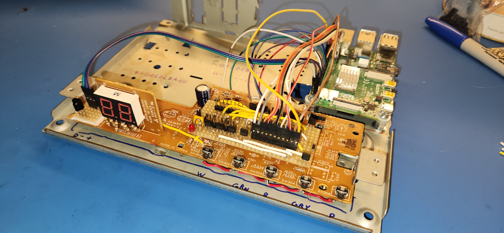
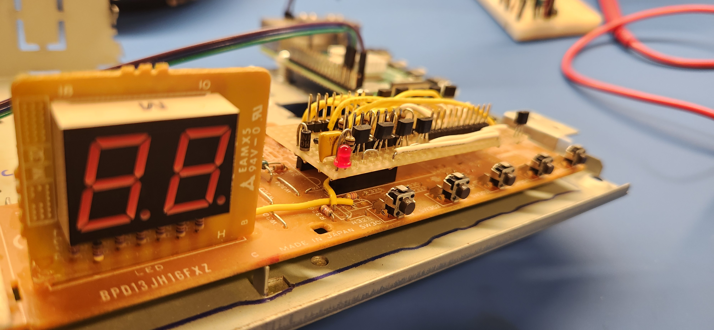
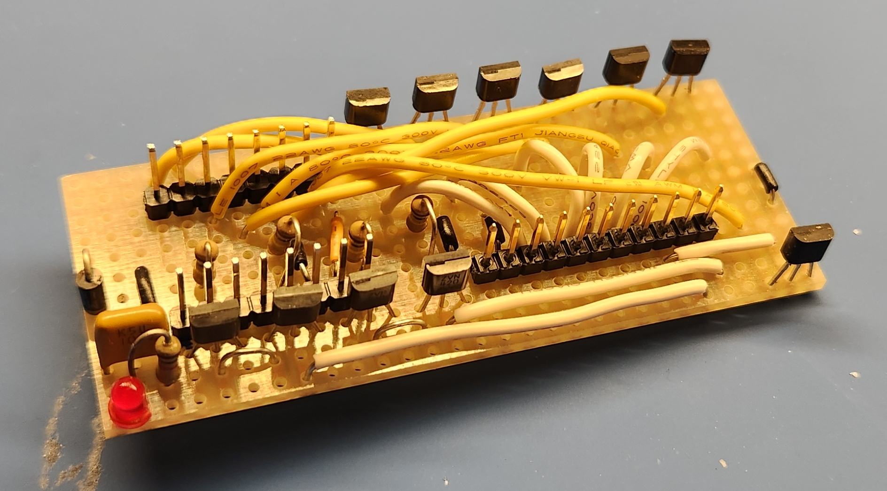
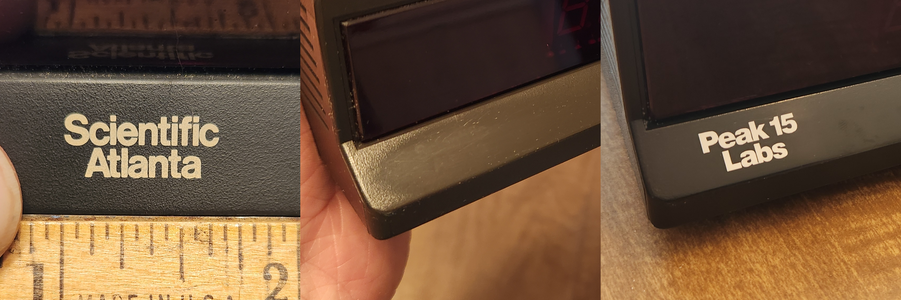
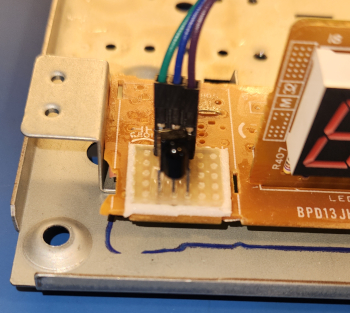

  
**by Peak 15 Labs**

Creates a classic TV-like experience from a collection of your own media.  
Originally designed to run on a Raspberry Pi stuffed inside an actual retro cable TV box, but should run on any linux machine.

## Hardware:

  
The tvbox software can be installed on any linux computer, but I want to show off the device I originally made it for.

  
A Raspberry Pi 4 crammed inside the case of an old Scientific Atlanta cable box I bought off of eBay! The original PCB has been retained but heavily modified. Most components are chopped off.

  
The main chip was replaced with female pin headers, and jumpers put in place throughout the board to make direct connections to the front panel 7-segment display. The front panel buttons are connected with flying leads soldered to the original PCB.

  
A custom stripboard circuit (I should make a schematic...) consisting of a bunch of ZVN4206A N-channel MOSFETs and a few ZVP2106A P-channel MOSFETs and a few pull-up/down resistors is plugged into the socket where the main chip once was to drive the 7-segment display. 

  
I removed the Scientific Atlanta logo by scrubbing with a paste of granulated sugar and Goo-Gone. I ordered a custom replacement logo decal from [smalllettering.com](https://smalllettering.com/).

  
The infrared receiver is a [TSOP98438](https://www.vishay.com/docs/82831/tsop982.pdf) wired directly to the Raspberry Pi, as shown in [this](https://www.digikey.com/en/maker/tutorials/2021/how-to-send-and-receive-ir-signals-with-a-raspberry-pi) guide. The software used to receive the signals is [LIRC](https://www.lirc.org/). Other similar IR receivers can work plugged directly into a USB FTDI cable such as TSOP2338 or TSOP2438, I forget which one, but I am using one of those on a different, non-raspberry-pi machine.

## Software Dependencies:

- python-vlc
- X11 (doesn't work well on wayland)
- ffprobe
- lxterminal
- feh
- wmctrl
- libnotify-bin (and a notification daemon)
- bash
- lirc (optional)
- gpiozero (optional)

Probably more. "It works on my machines." lol

## Software Instructions:

- (optional) Get [LIRC](https://www.lirc.org/) working. Some potentially useful files are in `external_config_files/lirc`.


- Install dependencies.


- Put the tvbox directory wherever you like, such as `~/tvbox`.


- Copy `tvboxrc.example` to `$XDG_CONFIG_HOME/tvboxrc` or `~/.config/tvboxrc` and customise.


- Create a directory for your channel files, such as `~/tvbox_media/channels`. Channel files can also be stored throughout your media collection, they do not need to be stored all in the same directory. tvbox will walk the entire directory tree specified by `$TVBOX_CHANNELS_DIR`.


- Generate your channel files using `makechannel`. Run `makechannel` with no arguments to see usage instructions. `makechannel` will output to stdout, pipe its output to a channel file, like:
```
# Running this command from inside ~/tvbox_media/channels/ to create relative paths.
~/tvbox/makechannel ../example_video_dir > example.channel
```


- Run `tvbox`. You can also run `irtvboxlaunch` instead, which first kills all tvbox related processes before running `tvbox`.


- To change to the next channel: Connect `GPIO017` to ground, press LIRC key `KEY_CHANNELUP`, or send `SIGUSR1`.  
To change to the previous channel: Connect `GPIO027` to ground, press LIRC key `KEY_CHANNELDOWN`, or send `SIGUSR2`.


- To exit, send `SIGTERM`. This can be done through LIRC with `irexec`.


- (optional) Put `external_config_files/tvbox.desktop` in `$XDG_CONFIG_HOME/autostart/` or `~/.config/autostart` to autostart tvbox.
